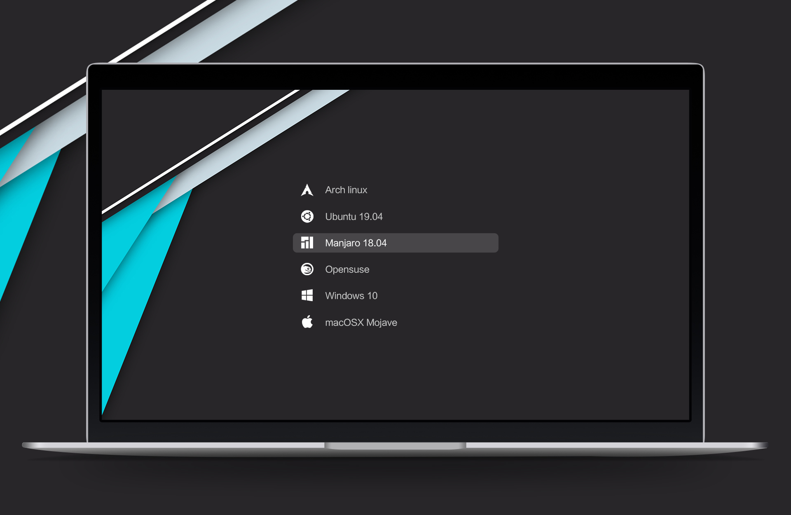
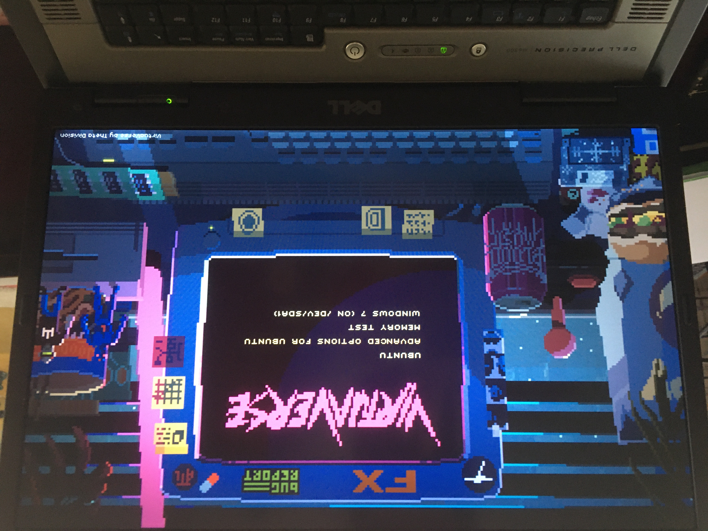
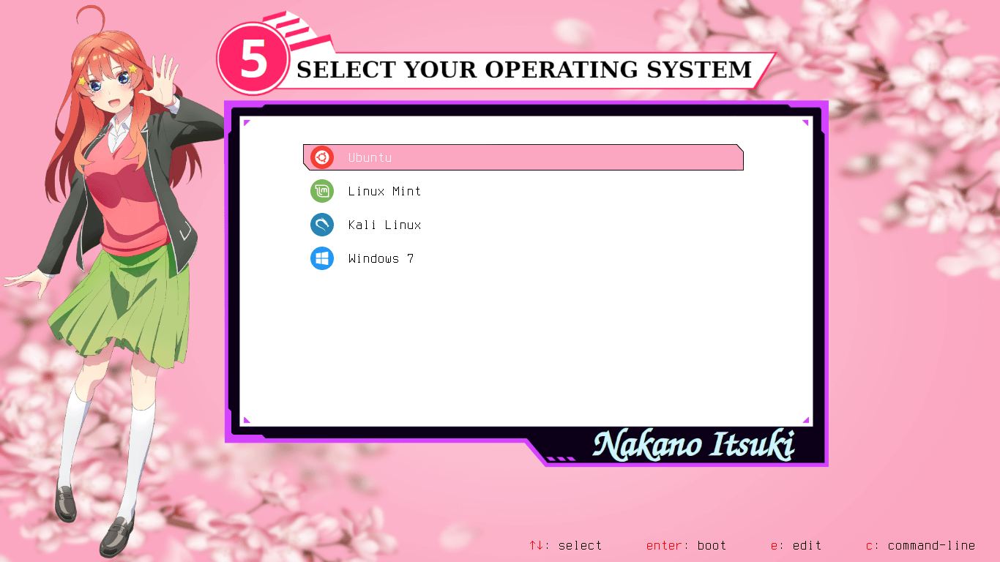
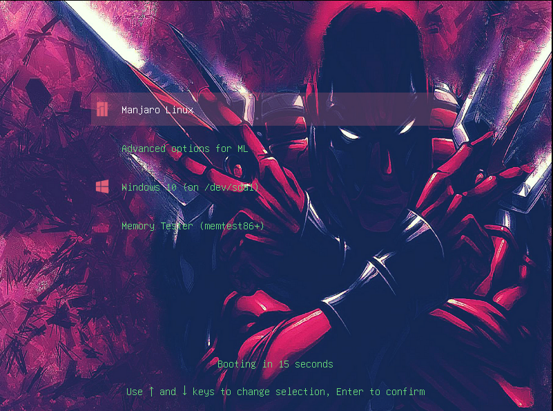

### Installation

* First clone this repo

  `git clone https://github.com/RomjanHossain/Grub-Themes.git`

* Change to cloned directory and make `install.sh` executable - 

  `cd Grub-Themes`

  `chmod +x install.sh`

* Run `install.sh` with `sudo` and select your theme 

## Screenshots of Grub-Themes

###### Vimix

#### 

Tela

Fallout

CyberRe

DedSec

### Arcade

#### 

### Mario

#### 

### sekiro

#### 

### virtua

#### 

Sleek

Bigsur 

Atomic

Ichika, Itsuki, Miku, Nino and Yotsuba

|  |  |     |
| -------------------------- | -------------------------- | --------------------------- |
|    |                            |  |

Arch,  Kali

|  |
| ------------------------ |
|  |

Cyberpunk

Cyberpunk2

Virtual Future

Darkmatter

Deadpool 

Monterey

Shodan

WhiteSur

polylight

## Real Repo of those Grub-Themes:

vimix, tela => https://github.com/vinceliuice/grub2-themes

fallout => https://github.com/shvchk/fallout-grub-theme

dedsec => https://github.com/vandalsoul/dedsec-grub2-theme

sleek => https://github.com/sandesh236/sleek--themes

bigsur => https://github.com/Teraskull/bigsur-grub2-theme

atomic => https://github.com/lfelipe1501/Atomic-GRUB2-Theme

ichika, itsuki, Miku, Nino, Yotsuba => https://github.com/13atm01/GRUB-Theme

polylight => https://github.com/shvchk/poly-light

Arch, Kali => https://github.com/xenlism/Grub-themes

cyberpunk => https://github.com/anoopmsivadas/Cyberpunk-GRUB-Theme

cyberpunk2 => https://github.com/NayamAmarshe/Cyberpunk-GRUB-Theme

darkmatter => https://github.com/vandalsoul/darkmatter-grub2-theme

deadpool => https://github.com/BishwasSagar/grub2-deadpool-theme

monterey => https://github.com/sandesh236/monterey-grub-theme

virtual future => https://gitlab.com/deck451/virtual_future_grub_theme

mario => https://github.com/Crylia/dotfiles.git

sekiro => https://github.com/semimqmo/sekiro_grub_theme/

virtuaverse => https://github.com/Patato777/dotfiles/tree/main/grub/themes/virtuaverse

among us => https://github.com/sueperb/tasty-grubs

arcade => https://github.com/nobreDaniel/dotfile.git